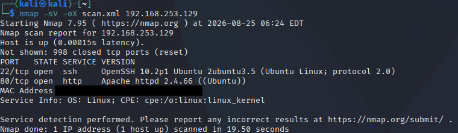
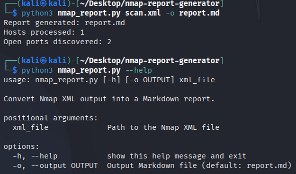
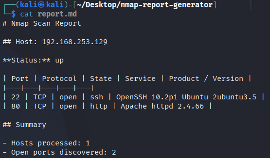

# Nmap Report Generator

A small Python command-line tool that converts **Nmap XML output** into a clean, readable **Markdown service report**.

I built this project as part of my hands-on cybersecurity learning to combine:

- Nmap service enumeration
- XML parsing
- Python automation
- command-line tool design
- Markdown reporting

The project uses a controlled lab consisting of a **Kali Linux VM** and an **Ubuntu Server VM** on an isolated VMware host-only network.

---

## What the tool does

```text
Ubuntu target VM
      |
      v
Nmap -sV scan
      |
      v
XML output
      |
      v
Python parser
      |
      v
Markdown report
```

The parser extracts:

- host IPv4 address
- host status
- open ports
- transport protocol
- service name
- detected product
- detected version
- total hosts processed
- total open ports discovered

---

## Lab environment

```text
┌──────────────────────┐
│      Kali Linux      │
│                      │
│  Nmap + Python CLI   │
└──────────┬───────────┘
           │
           │ VMware host-only network
           │
┌──────────▼───────────┐
│   Ubuntu Server VM   │
│                      │
│ SSH         :22      │
│ Apache HTTP :80      │
└──────────────────────┘
```

The Ubuntu VM exposed only services configured specifically for the lab:

- OpenSSH on TCP/22
- Apache HTTP Server on TCP/80

No third-party systems were scanned.

---

## 1. Generate Nmap XML

From Kali Linux:

```bash
nmap -sV -oX scan.xml <target-ip>
```

| Option | Purpose |
|---|---|
| `-sV` | Detect service and version information |
| `-oX` | Save Nmap results as XML |

Example lab result:



The scan identified OpenSSH on TCP/22 and Apache HTTP Server on TCP/80.

---

## 2. Run the report generator

Basic usage:

```bash
python3 nmap_report.py scan.xml
```

By default, the tool creates `report.md`.

To choose a custom output filename:

```bash
python3 nmap_report.py scan.xml -o ubuntu-target-report.md
```

Example terminal output:

```text
Report generated: report.md
Hosts processed: 1
Open ports discovered: 2
```

---

## 3. CLI help

The script uses Python's `argparse` module.

```bash
python3 nmap_report.py --help
```



This makes the tool reusable with any compatible Nmap XML file rather than requiring a hard-coded filename.

---

## 4. Generated Markdown report

The XML data is converted into a readable Markdown table.



Example:

```markdown
# Nmap Scan Report

## Host: 192.168.253.129

**Status:** up

| Port | Protocol | State | Service | Product / Version |
|---|---|---|---|---|
| 22 | TCP | open | ssh | OpenSSH 10.2p1 Ubuntu 2ubuntu3.5 |
| 80 | TCP | open | http | Apache httpd 2.4.66 |

## Summary

- Hosts processed: 1
- Open ports discovered: 2
```

---

## How the parser works

Python's standard-library XML parser is used:

```python
import xml.etree.ElementTree as ET
```

The program loads the Nmap XML:

```python
tree = ET.parse(xml_file)
root = tree.getroot()
```

It then iterates through scanned hosts:

```python
for host in root.findall("host"):
```

The IPv4 address is selected explicitly:

```python
address = host.find("address[@addrtype='ipv4']")
```

This is important because Nmap XML can contain more than one `<address>` element, such as IPv4 and MAC addresses.

The script then iterates through port entries and extracts the port, protocol, state, service, product and version fields. Only ports with state `open` are written to the final report.

---

## Project structure

```text
nmap-report-generator/
├── nmap_report.py
├── README.md
├── CHANGELOG.md
├── .gitignore
├── example/
│   ├── sample_scan.xml
│   └── sample_report.md
└── screenshots/
    ├── 01-nmap-service-scan.png
    ├── 02-generated-markdown-report.png
    └── 03-cli-help.png
```

---

## Try the included example

No scan is required to test the parser:

```bash
python3 nmap_report.py example/sample_scan.xml -o test-report.md
```

The result should match `example/sample_report.md`.

---

## What I learned

This project helped me connect several areas I had been learning separately.

### Nmap
I used service/version detection and XML output rather than only reading Nmap's terminal output.

### XML
I inspected raw Nmap XML and learned how hosts, addresses, ports, states and service information are represented as structured elements and attributes.

### Python
I practised `xml.etree.ElementTree`, loops, conditionals, string formatting, functions, file output and `argparse`.

### Automation
Instead of manually copying scan results into a report, the script transforms structured Nmap output into a consistent Markdown format automatically.

### Lab design
I also built an isolated Kali-to-Ubuntu VMware lab and configured deliberate target services for controlled reconnaissance.

---

## Security and ethics

This project was developed only against systems I own and control.

The example XML is sanitized and contains no MAC address or sensitive information. The original lab scan data is not required to use the project.

Use Nmap only against systems you own or have explicit authorization to test.

---

## Current limitations

Version 1.0 intentionally has a small scope. It currently:

- expects standard Nmap XML
- reports IPv4 hosts
- includes only open ports
- generates Markdown only
- does not perform vulnerability or CVE analysis

Keeping the first version small allowed me to focus on making the core parsing and reporting workflow clear and reliable.

---

## Possible future improvements

- hostname extraction
- scan metadata and timestamps
- multi-host testing
- CSV or JSON output
- numeric port sorting
- operating-system information
- comparison between scans
- unit tests
- optional AI-assisted report summaries

---

## Version

**v1.0** — core Nmap XML → Markdown reporting workflow complete.
